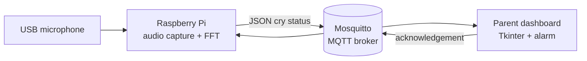

# Baby Cry Monitoring System

An end-to-end IoT prototype that detects cry-like audio on a Raspberry Pi and alerts a parent through a desktop dashboard. The project combines real-time audio capture, FFT-based signal analysis, MQTT messaging, temporal smoothing, and a Tkinter interface across two physical devices.

> **Safety note:** This is an educational prototype, not a medical device or a substitute for direct adult supervision. Its threshold-based detector can produce false positives and false negatives.

## System overview



The Raspberry Pi records one-second, 16 kHz mono audio frames and estimates how much spectral energy falls within broad voice and narrow beep frequency bands. It publishes the resulting measurements and smoothed cry state as JSON. The laptop dashboard evaluates a rolling history, activates an alarm when seven of the last ten samples indicate crying, and keeps the alarm active until a parent acknowledges it.

## Features

- One-second audio sampling through ALSA `arecord`
- FFT-based energy analysis with NumPy and SciPy
- Voice-band and beep-band heuristics to reject quiet or tone-like frames
- Consecutive-frame filtering on the Raspberry Pi
- MQTT publish/subscribe communication between devices
- Ten-sample rolling window on the parent dashboard
- Visual and audible alarm with manual acknowledgement
- JSON telemetry for debugging and future integrations

## Architecture

| Component | Responsibility | Technology |
| --- | --- | --- |
| Raspberry Pi | Records audio, computes FFT metrics, and classifies each frame | Python, NumPy, SciPy, ALSA |
| MQTT broker | Routes status and acknowledgement messages | Mosquitto, Paho MQTT |
| Parent laptop | Displays live state, smooths recent predictions, and controls the alarm | Python, Tkinter, `winsound` |

### MQTT topics

| Topic | Direction | Payload |
| --- | --- | --- |
| `jaimem57/baby/cry_status` | Pi to dashboard | Frame number, timestamp, energy ratios, and cry state |
| `jaimem57/baby/parent_ack` | Dashboard to Pi | Acknowledgement flag and timestamp |

## Detection pipeline

1. Capture a one-second PCM frame at 16 kHz.
2. Remove the DC offset and compute a real-valued FFT.
3. Calculate total spectral energy.
4. Compare energy in the 300-3000 Hz voice band with the 900-1100 Hz beep band.
5. Mark a frame as cry-like when it is loud enough, voice-dominated, and not dominated by a narrow tone.
6. Require two consecutive cry-like frames before publishing an active cry state.
7. Trigger the dashboard alarm when at least 70% of the last ten states are active.

The thresholds are intentionally visible in `cry_detector_publisher.py` so they can be calibrated for a different microphone or room.

## Requirements

### Raspberry Pi

- Raspberry Pi 4 or similar Linux device
- USB microphone
- Python 3.9+
- `arecord` from `alsa-utils`
- Mosquitto broker

### Parent dashboard

- Windows laptop with Python 3.9+
- Network access to the Raspberry Pi
- Tkinter and `winsound` (included with standard Windows Python installations)

Install the shared Python packages:

```bash
python -m pip install -r requirements.txt
```

## Setup

### 1. Configure the Raspberry Pi

```bash
sudo apt update
sudo apt install -y alsa-utils mosquitto mosquitto-clients python3-pip
sudo systemctl enable --now mosquitto
python3 -m pip install -r requirements.txt
```

Plug in the USB microphone and confirm that ALSA can see it:

```bash
arecord -l
```

If necessary, update the `arecord` device arguments in `record_frame()`.

### 2. Configure the dashboard

Set `BROKER_HOST` in `parent_dashboard.py` to the Raspberry Pi's local IP address. Both devices must be able to reach TCP port `1883` on the trusted local network.

The optional alarm file is expected at:

```text
mixkit-warning-alarm-buzzer-991.wav
```

If it is absent, the dashboard falls back to the system bell.

### 3. Run both nodes

On the Raspberry Pi:

```bash
python3 cry_detector_publisher.py
```

On the Windows laptop:

```powershell
python parent_dashboard.py
```

## Limitations and next steps

- The detector uses manually tuned frequency and energy thresholds rather than a trained classifier.
- Microphone sensitivity and room acoustics require per-device calibration.
- Background voices or broadband noise can cause misclassification.
- The local MQTT setup does not include authentication or TLS; keep it on a trusted network.
- A production design should avoid retaining raw audio, encrypt communication, add health monitoring, and validate performance on a diverse labeled dataset.

Good next steps include adaptive noise-floor estimation, a labeled evaluation set, precision/recall reporting, an ML audio classifier, authenticated MQTT, and a lightweight event history.

## Project report

The repository includes the original [end-to-end project report](<Baby Cry Monitoring System – End-to-End IoT Project Report.docx>) with the full design rationale, architecture, signal-processing details, and lessons learned.

## Team and course context

Developed as an EE250 final project.
